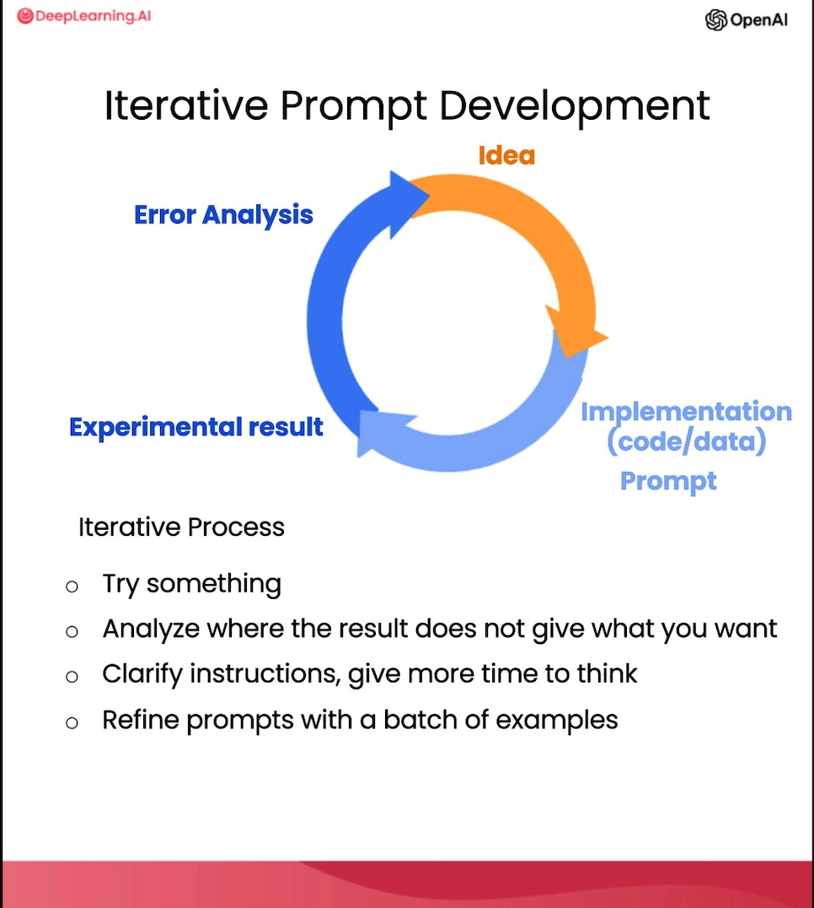

# EBOOK

## Automate the Boring Stuff with Python references

### Chapter 1

On this chapter there were no topics or ideas that resonated with
me, since I am very familiar and proficient with the ideas and
concepts its shows in this Chapter. 

#### Chapter 2
#### Chapter 3
#### Chapter 4
#### Chapter 5
#### Chapter 6
#### Chapter 7
#### Chapter 8
#### Chapter 9

# VIDEOS

## APIs for Beginners - How to use an API (Full Course/Tutorial) (Reference: https://www.youtube.com/watch?v=WXsD0ZgxjRw)

Glossary:

* API  (Application Programming Interface)
* GUI  (Graphical User Interface)
* URL  (Universal Resource/Object Locator)
* HTTP (HyperText Transfer Protocol)
* REST (Representational State Transfer)
* HTML (Hyper Text Markup Language)
* CRUD (Creating Reading Updating Deleting)

-- APIs allow us to interact or communicate with objects, whether
physical or software.
* Provides data.
* APIs can be built-in in a code language. An example of this is when
use this method to transform from lower to upper case [variable.upper()]
These methods are part of the API built-in the Python language.
* It is a way to outsource requirements for data 
  * Patient records
  * Location as a pin
  * Execution of financial transaction
* Remotes APIs: Computational power, as Google Cloud does.
* REST (Representational State Transfer): used to design networked applications
used to build APIs for web services.

  * RESTful (architectural style that allow different computers to communicate over the internet)
    * Client Server Architecture
      * Statelessness                       HEADER   
        * Program/Client makes a request --> HTTP --> SERVER 
    * Cacheability
    * Layered System
      * Spotify data retrieval as a JSON structure
    * Code on Demand
    * Uniform Interface 
  
--HTTP METHODS
  * GET (Read) requesting data to server
  * POST (Create) submitting or posting data to server
  * PUT (Update/REeplace): Update resource replacing it with new data. 
  * PATCH (Partial Update): Makes small or specific changes without changing all. 
  * DELETE (Remove): Used to delete resources from server

## ChatGPT Prompt Egineering for Developers (Reference: https://learn.deeplearning.ai/my/learning)

CONCEPTS: 
* RLHF (Reinforcement Learning with Human Feedback)

* Based LLM: Predicts next word, based on training data
* Instruction Tuned LLM: tries to follow instructions 
  * Fine tune on instructions and good attempts at following those instructions. 
  * RLHF (Reinforcement Learning with Human Feedback)

## Principles of prompting
* Principle 1 : Write clear and specific instructions
    * Tactic 1: Use delimiters
      * Triple quotes: """
      * Triple backticks: ```
      * Triple dashes: ---
      * Angle brackets: <>
      * XML tags: <tag> </tag>
    * Tactic 2: Ask for structured output
      * HTML, JSON
    * Tactic 3: Check whether conditions are satisfied. 
      * Check assumptions required to do the task.
    * Tactic 4: Few-shot prompting
      * Give successful examples of completing tasks
      * Then ask model to perform the task
      
* Principle 2 : Give the model time to think
  * Tactic 1: Specify the steps required to complete a task
    * STEP 1:..
    * STEP 2:..
    * ...
    * STEP N:
  * Tactic 2: Instruct the model to work out its own solution before rushing to a conclusion.
  
MODEL LIMITATIONS 
* HALLUCINATIONS
  * Makes statements that sound plausible but are not true.
* REDUCING HALLUCINATIONS
  * First find relevant information, then answer the question based on the relevant information. 

## ITERATIVE PROMPT DEVELOPMENT
### Iterative Process
* Try Something
* Analyze where the result does not give what you want
* Clarify instructions, give more time to think
* Refine prompts with a batch of examples



